# 🍔 Food Delivery App - App Đặt Đồ Ăn

Ứng dụng đặt đồ ăn trực tuyến (Food Delivery) được xây dựng trên nền tảng Flutter và cơ sở dữ liệu nội bộ SQLite. Ứng dụng cung cấp đầy đủ các tính năng cho cả Khách hàng (đặt món, tìm kiếm, giỏ hàng, thanh toán, đánh giá) và Quản trị viên (quản lý món ăn, danh mục, đơn hàng, người dùng, thống kê doanh thu).

---

## 📸 Giao diện Ứng dụng (Screenshots)

### 📱 Giao diện Khách hàng

Trang Chu

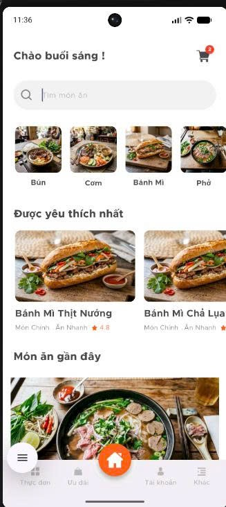

Chi tiết món

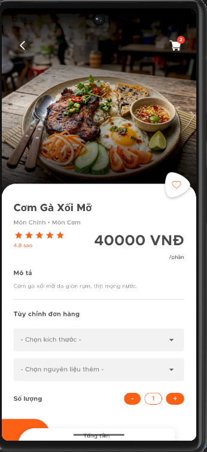

Thực đơn

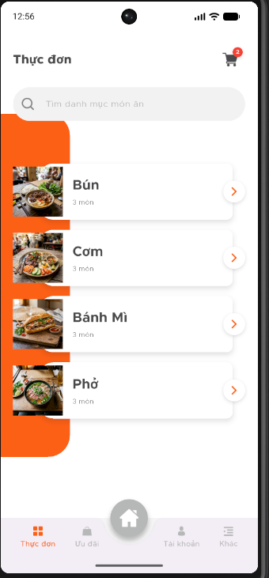

Ưu đãi

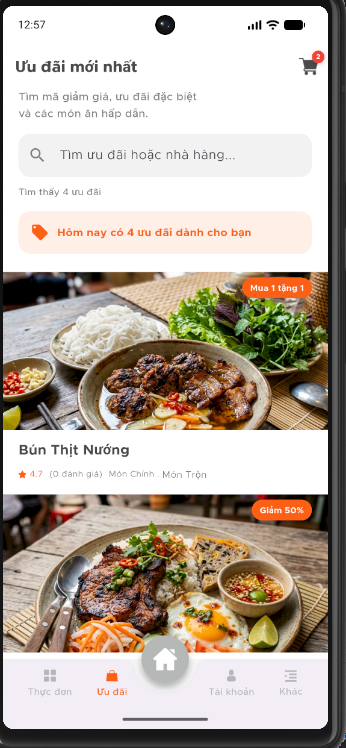

Giỏ hàng

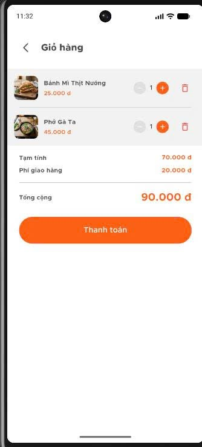

Thanh toán

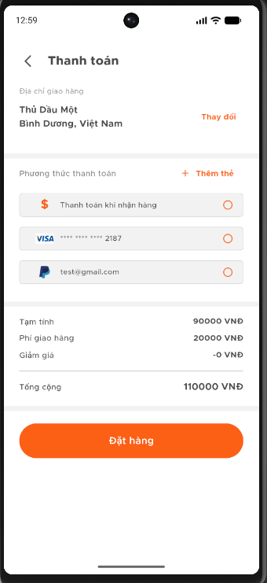

Thông tin cá nhân

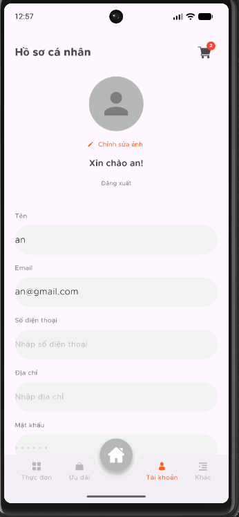

Khác

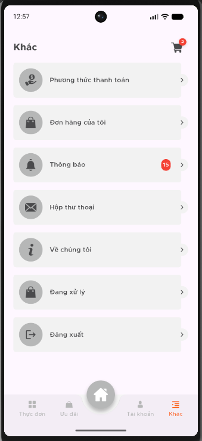


### 🛠️ Giao diện Quản trị viên (Admin)

Dashboard Quản trị 

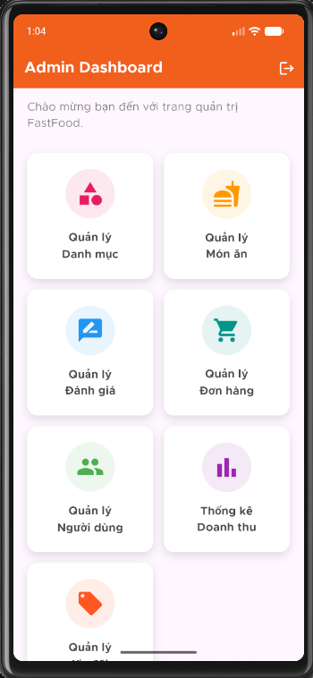

Quản lý Danh mục 

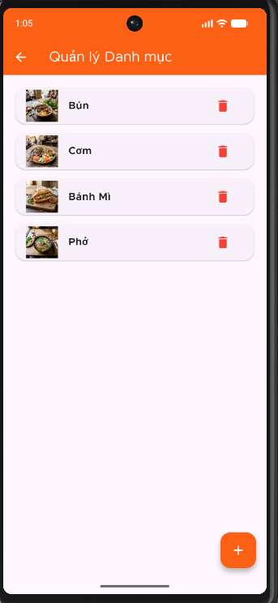

Quản lý Đơn hàng

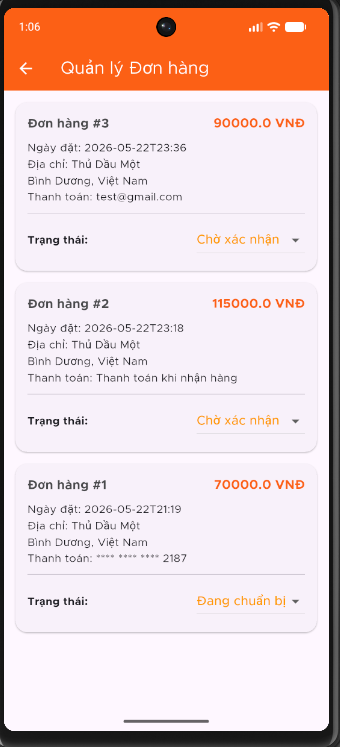

Quản lý Món ăn

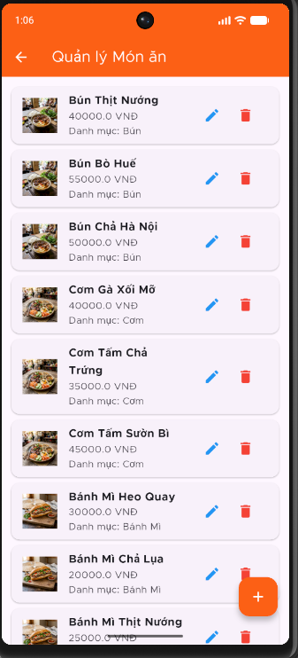

---

## ✨ Tính năng chính

### 👤 1. Dành cho Khách hàng
* **Đăng ký & Đăng nhập:** Tạo tài khoản, đăng nhập và tự động lưu phiên làm việc (không cần đăng nhập lại ở các lần sau).
* **Trang chủ động (Dynamic Home):** Phân loại món ăn theo danh mục, hiển thị các món ăn phổ biến và món ăn mới cập nhật.
* **Tìm kiếm thông minh:** Tìm kiếm món ăn nhanh chóng, hỗ trợ tìm kiếm không dấu (accent-insensitive) và lọc kết quả chính xác.
* **Xem chi tiết & Đặt món:** Xem mô tả món ăn, đánh giá từ khách hàng khác, tùy chỉnh số lượng và thêm vào giỏ hàng.
* **Quản lý Giỏ hàng:** Tăng/giảm số lượng, xóa món ăn khỏi giỏ hàng, tính toán tổng tiền và chi phí vận chuyển tự động.
* **Thanh toán tiện lợi:** Chọn phương thức thanh toán (Tiền mặt, Visa, PayPal), nhập địa chỉ nhận hàng và tiến hành đặt hàng.
* **Quản lý Đơn hàng:**
  * **Đang xử lý:** Theo dõi trạng thái đơn hàng hiện tại đang được chuẩn bị hoặc giao đi.
  * **Lịch sử đơn hàng:** Xem lại tất cả đơn hàng đã giao thành công hoặc đã hủy.

### 🔑 2. Dành cho Quản trị viên (Admin)
* **Dashboard Tổng quan:** Xem nhanh số lượng người dùng, đơn hàng và biểu đồ thống kê doanh thu.
* **Quản lý Danh mục:** Thêm mới, chỉnh sửa tên hoặc xóa các danh mục món ăn.
* **Quản lý Món ăn:** Thêm món ăn mới kèm theo hình ảnh, mô tả, giá bán và phân loại danh mục. Sửa thông tin hoặc xóa món ăn.
* **Quản lý Đơn hàng:** Xem tất cả đơn hàng của khách hàng, cập nhật trạng thái đơn hàng (Đang xử lý, Thành công, Đã hủy).
* **Quản lý Đánh giá:** Theo dõi danh sách các phản hồi và đánh giá từ khách hàng.
* **Quản lý Người dùng:** Danh sách các tài khoản người dùng đã đăng ký trên hệ thống.

---

## 🛠️ Công nghệ sử dụng

* **Frontend:** Flutter SDK (Dart)
* **Local Database:** SQLite (`sqflite` & `path` packages)
* **Session Management:** `shared_preferences`
* **Custom Fonts:** Metropolis font family

---

## 📂 Cấu trúc thư mục dự án

```text
lib/
├── common/             # Các lớp định nghĩa màu sắc, định dạng, biến toàn cục...
├── common_widget/      # Các widget dùng chung trong ứng dụng (nút bấm, textfield...)
├── database/           # DBHelper định nghĩa cấu trúc bảng SQLite và các hàm CRUD
├── main.dart           # File khởi chạy chính của ứng dụng
└── view/               # Giao diện ứng dụng được chia theo nhóm chức năng
    ├── admin/          # Giao diện dành riêng cho quản trị viên
    ├── home/           # Giao diện trang chủ khách hàng
    ├── login/          # Giao diện Đăng nhập, Đăng ký, Welcome
    ├── main_tabview/   # Giao diện thanh Tab điều hướng chính
    ├── menu/           # Xem danh sách món ăn theo danh mục & Chi tiết món ăn
    ├── more/           # Cài đặt thêm, giỏ hàng, thanh toán, quản lý đơn hàng
    ├── offer/          # Giao diện hiển thị các khuyến mãi/ưu đãi
    ├── on_boarding/    # Giới thiệu ứng dụng khi mở lần đầu
    └── profile/        # Quản lý hồ sơ người dùng cá nhân
```


